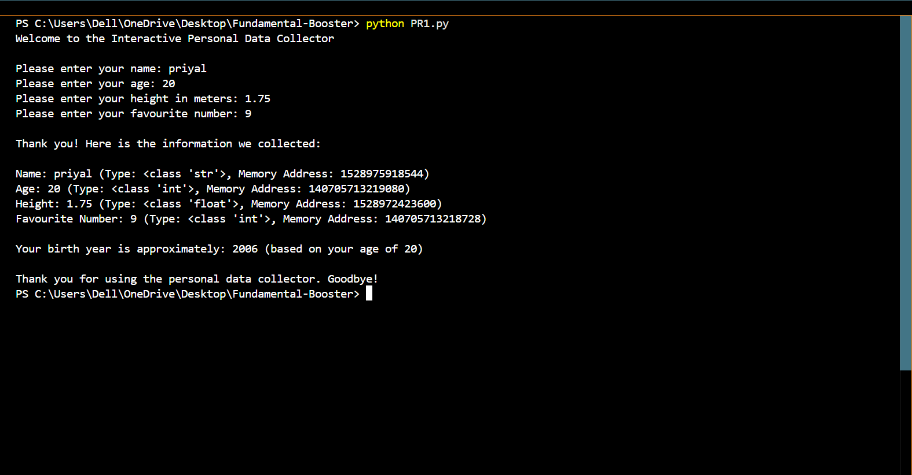

<div align="center">

# 🚀 Fundamental Booster Project

### 💻 Interactive Personal Data Collector

A beginner-friendly Python project developed using **VS Code** to demonstrate fundamental Python programming concepts.


</div>

---

# 📌 Project Overview

The **Interactive Personal Data Collector** is a Python application that collects user information, demonstrates data types, memory addresses, user input handling, arithmetic calculations, and displays a formatted summary report.

This project is created as part of the **Fundamental Booster Assignment** using **Python and VS Code**.

---

# 🎯 Project Objectives

* Learn Python fundamentals
* Understand variables and data types
* Practice user input handling
* Perform arithmetic calculations
* Demonstrate type casting
* Use `type()` and `id()` functions
* Display formatted output

---

# ✨ Features

✅ User-friendly interface

✅ Accepts user input

✅ Performs arithmetic operations

✅ Calculates Approximate Birth Year

✅ Demonstrates Type Casting

✅ Displays Variable Data Types

✅ Displays Memory Addresses

✅ Generates a clean summary report

---

# 🛠 Technologies Used

| Technology | Purpose                 |
| ---------- | ----------------------- |
| Python 3   | Programming Language    |
| VS Code    | Development Environment |

---

# 📂 Project Structure

```text
Fundamental-Booster/
│
├── PR1.py
├── Project_Demonstration_Priyal_Patel.mp4
├── output.png
└── README.md
```

---

# 🎥 Project Demonstration Video

The complete project explanation and execution video is available in this repository.

📹 **Project_Demonstration_Priyal_Patel.mp4**

Open the video file to watch the complete project demonstration.

---

# 📸 Program Output



---

# 📚 Python Concepts Covered

* print()
* input()
* Variables
* Data Types
* Type Casting
* Arithmetic Operators
* type()
* id()
* Formatted Printing

---

# ▶️ How to Run

1. Open the project folder in **VS Code**
2. Open `PR1.py`
3. Open the terminal
4. Run the program using:

```bash
python PR1.py
```

5. Enter the required details
6. View the output
7. Save the output screenshot as **output.png**
8. Watch `Project_Demonstration_Priyal_Patel.mp4` for complete project explanation

---

# 📄 Sample Input

| Input            | Example |
| ---------------- | ------- |
| Name             | Priyal  |
| Age              | 20      |
| Height           | 1.75    |
| Favourite Number | 9       |

---

# 📋 Sample Output

```text
Welcome to the Interactive Personal Data Collector

Please enter your name: Priyal
Please enter your age: 20
Please enter your height in meters: 1.75
Please enter your favourite number: 9

Thank you! Here is the information we collected:

Name: Priyal
Age: 20
Height: 1.75
Favourite Number: 9

Your birth year is approximately: 2006

Thank you for using the personal data collector. Goodbye!
```

---

# 👩‍💻 Author

**Priyal Patel**

Python Programming Student

---

<div align="center">

## ⭐ Thank You ⭐

If you like this project, don't forget to ⭐ the repository.

Made with ❤️ using Python

</div>
